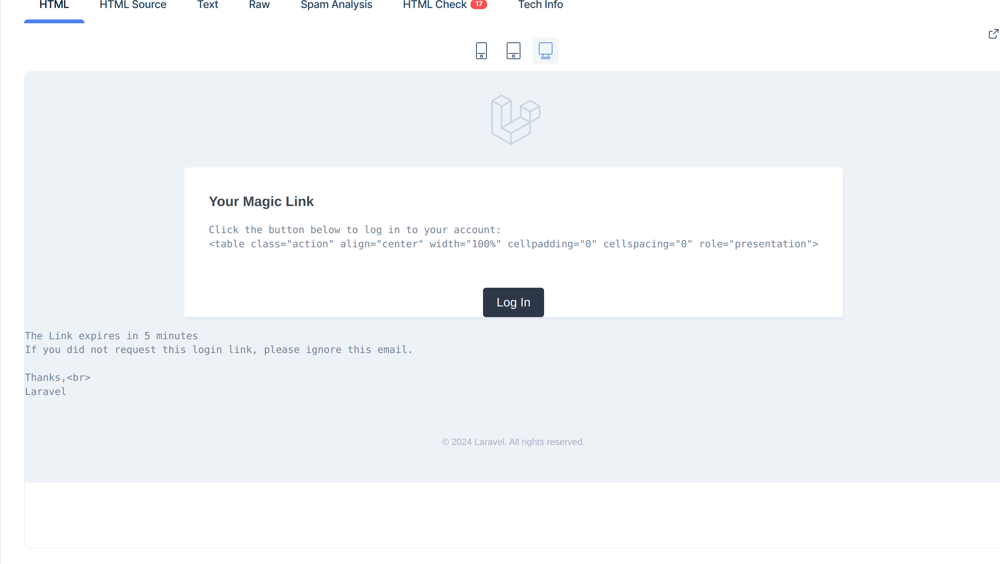
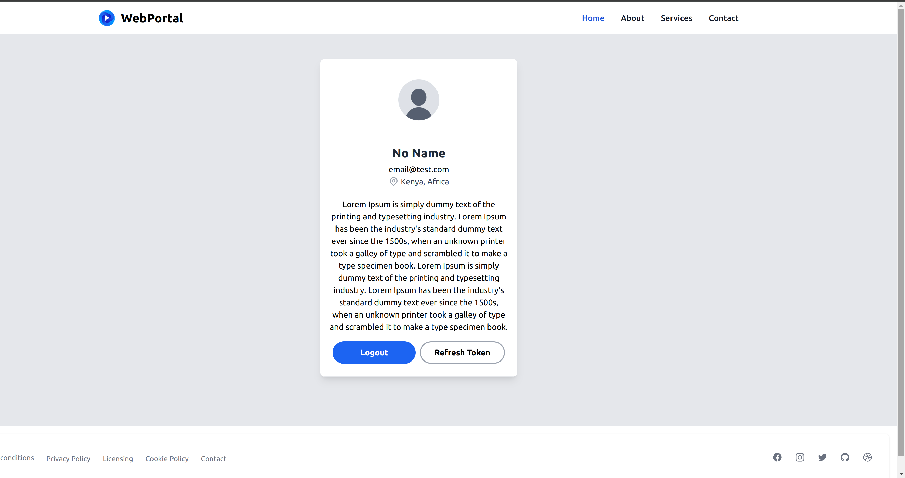
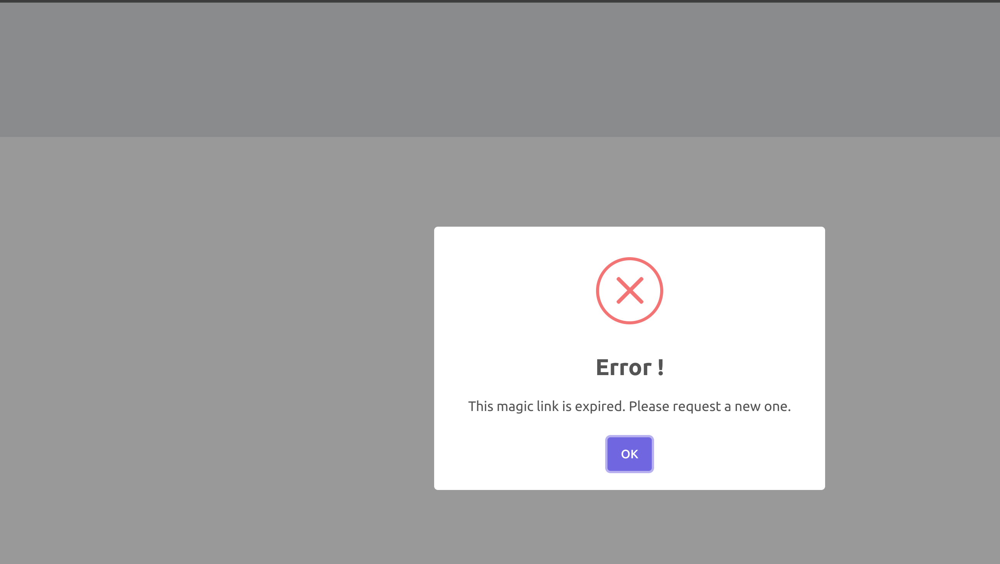

# A Magic email login web portal

A web app using laravel 10 vue 3 and JWT to manage user sessions

### Requiremenst

```
1. PHP 8.1 and above
2. Node 16 and above 
3. MYSQL 
4. Free port 3000 and 8000
```

## Installation

clone the repository

```bash
git clone 
```

Install Laravel Dependencies [backend-api](backend-api)

```bash
cd test/backend_api
composer install  
```

Copy the .env.example file [.env.example](backend-api%2F.env.example)

```bash
cp .env.axample .env
```

Generate Key

```bash
cd test/backend_api
composer Php artisan key:generate  
```

Update Database Configs

```bash
DB_CONNECTION=mysql
DB_HOST=127.0.0.1
DB_PORT=3306
DB_DATABASE=web_portal
DB_USERNAME=root
DB_PASSWORD=P@ssw0rd
```

Update Mail Keys

```bash
MAIL_USERNAME=
MAIL_PASSWORD=
```

Generate JWT SECRET

```bash
php artisan jwt:generate
```

Run the backend

```bash
php artisan serve
```

On a new Terminal Window cd to [frontend_app](frontend_app) and install npm

```bash
cd  frontend_app

npm install
```

Run the UI

```bash
npm run dev
```

Run the UI

```bash
npm run dev
```

Open http://localhost:3000/login to serve the project 


Login/Index page 


Sample Email




Profile Page 



Invalid Link Error 



### missing items

```
1. Laravel Unit test
2. Styles and formats for emails 
3. OS, Browser and othe metadata for links management
4. Typesciption support
5. Proper env support backend needs to run on port 8000 and frontend port 3000
6. No containerzition
```

